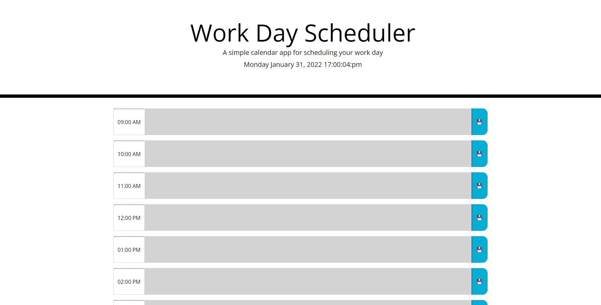

# Work-Day-Planner
## Description
This is a simple planner used to store the names of your projects for your typical day in the office. It uses local storage to save your prjects so no data will be lost if you accidently close the site as long as you press the save icon.
## Table of Contents (Optional)
- [Usage](#usage)
- [Credits](#credits)
- [Tests](#tests)
## Usage
To fully use this planner all you need to do is navigate to the link below. once you have done so you can simply type in the name of your project into the time field and click the save icon to the right of that field. this will prompt the website to save this data for you to easily keep track of the projects you have going on for the day.
https://dfaidley23.github.io/Work-Day-Scheduler/
    
## Credits
- MDN for help with syntax.
- My tutor for help with limiting the code down to a very dynamic format.
- The DU staff for help and instruction during the coarse.
## Tests
To test the sites functionality you simply need to enter a project name in any time slot. Once you press the save icon the data will remain even if the site is closed.